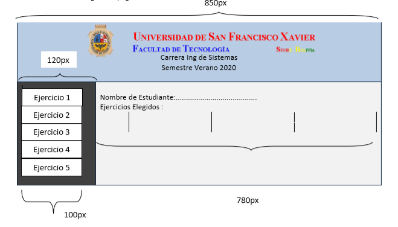
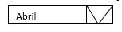
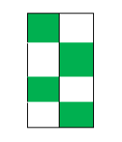
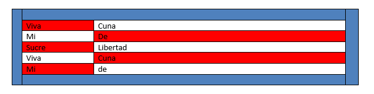
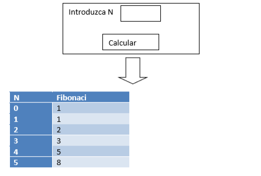

# Desarrollo web

## ejercicio 1

[ir al ejercicio](https://github.com/Hidel57/ejercicios-web/tree/main/pregunta1)

Realizar la siguiente página llamada index.html

## ejercicio 2

[ir al ejercicio](https://github.com/Hidel57/ejercicios-web/tree/main/pregunta2)

Programa en PHP llamarle pregunta2 que solicite mediante formulario por GET  el valor de  n (del 1 al 12) que llame a la página mes.php recupere el valor introducido y en base a ese al valor introducido muestre una lista de selección con los meses del año mostrando seleccionado el mes seleccionado. ejemplo para n=4

 
## tablas intercaladas
 
### ejemplo 1
 
Solicitar mediante formularios filas y columnas  luego llamar a la página tablaintercalado.php que imprime la tabla con los valores con la cantidad de filas  y columnas introducidas pero con colores intercalados entre los colores verde y blanco , al estilo de un tablero de ajedrez de 30px x 30px  Ej: para 4 filas y 2 columnas.(utilizar css con clases) 
 

### ejemplo 2

[ir al ejercicio](https://github.com/Hidel57/ejercicios-web/tree/main/pregunta3)

solicitar mediante formularios filas y columnas  luego llamar a la página tablaintercalado.php que imprime la tabla con los valores con la cantidad de filas  y columnas introducidas pero con colores intercalados entre múltiplos de tres con los colores rojo, amarillo y verde Ej: para 5 filas y 2 columnas.(utilizar css con clases) 
 

## ejercicio 4
 
Realice un programa que muestre las noticias de la tabla noticia(vernoticias.php) y cree un enlace para editar noticia y eliminar noticia, también un enlace que llame a insertar noticia. Las  notificas tienen los campos titular,fecha, texto,imagen
 
## ejercicio 5
 
Crear  un programa  en php que solicite un numero mediante formularios y llame a fibonaci.ph que guarda en la tabla fibonaci que tiene los campos n y fibonaci llene los numero fibonaci hasta el numero indicado. Luego imprima la tabla guardada con los estilos mostrados ej:
 
 

## Menu de Operaciones

### ejemplo 1

 Crear la clase operaciones que tiene métodos  sumar, restar, multiplicar que permiten generar la tabla respectiva de un numero dado n ( del 1 al 10), luego realizar un programa  en php que solicite mediante formulario un numero esta llame a menú que muestra las opciones de las operaciones suma,  resta  y multiplicación. El usuario seleccionando la opción correspondiente, el sistema le muestre la tabla correspondiente . Para persistir el numero utilizar cookies.

### ejemplo 2

[ir al ejercicio](https://github.com/Hidel57/ejercicios-web/tree/main/pregunta5)

Crear la clase operaciones con los atributos ay b que deben ser inicializados en el constructor, y las operaciones suma, resta, multiplicación y división, luego a través de un menú con las opciones llenar ay b,sumar,restar,multiplicar,dividir permita que el usuario selecciónela opción y muestre el resultado 
